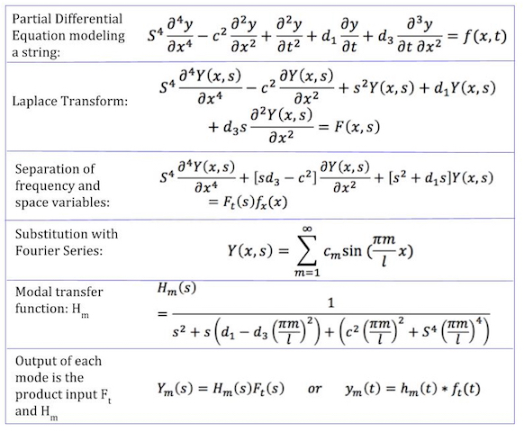

<h1>Four Dimensional Sound Synthesis</h1>

The functional transformation method (FTM) allows for transformations with respect to time
and space and helps to model sounds of musical instruments that can be described by partial
differential equations (PDEs) such as a string or a drum. A string vibrates along two dimensions
(space and time) whereas a drum vibrates in 3 dimensions (time and two spatial dimensions).

Various parameters, i.e. the coefficients for PDEs, can be utilized to model a sound of a specific
instrument. For example, a string would include parameters such as stiffness of the string
and string length. Each instrument also has specific zeroes and poles that correspond to the
Fourier transform of its PDE which also has to do with the sound that is produced. Together, the
parameters and the poles of the PDE help create the unique sound of the instrument.

The purpose of this research is to develop a way to traverse the dimensions of sound, and
assimilate to higher dimensions of sound that cannot be physically produced. The implementation
of these equations will be done in real-time, using Python. In order to carry out the implementation,
we first derive the appropriate PDE for the string. Next, we apply the FTM to account for another
dimension, producing the sound of a drum. This allows for the morphing of the sound of a string
and a drum. Furthermore, utilizing the FTM again will allow for the addition of another dimension to
produce 4-D sound.

This project was a part of the NYU Undergraduate Summer Research Program:
http://engineering.nyu.edu/files/2016_Summer_Research_Viewbook.compressed.pdf
